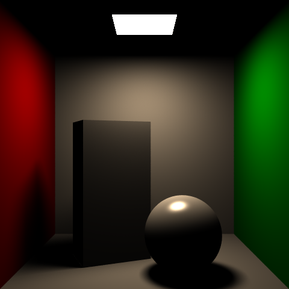
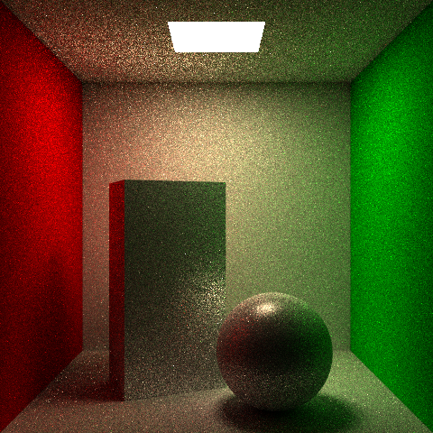
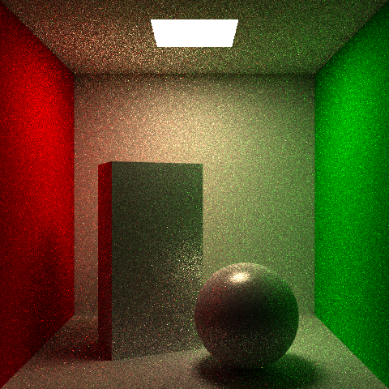
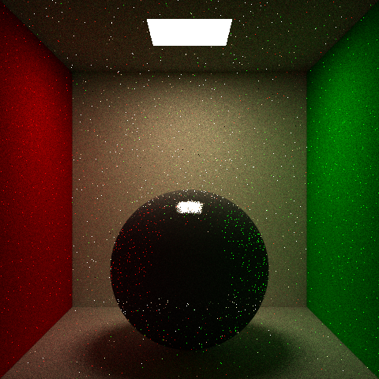
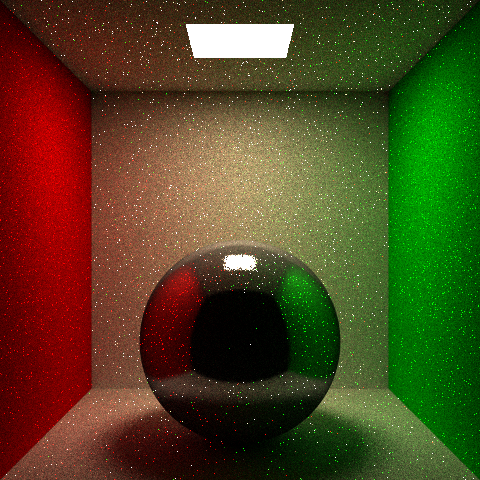
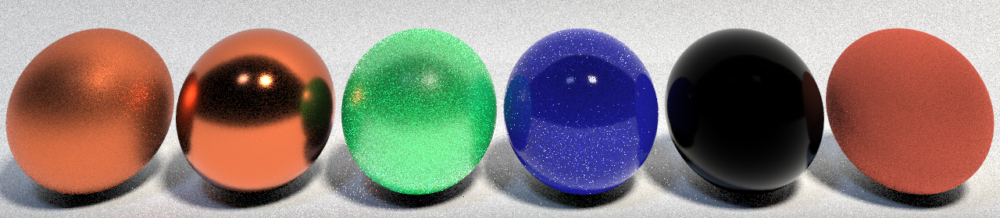

# Optix-Based-Path-Tracer

A Path Tracer built with Nvidia Optix. The installation guidelines can be found in the INSTALL-WIN.txt. The required version of is 6.5 for Optix and 10.1 for Cuda. 
In this renderer, the following functionalities are implemented and more are coming. Examples are shown below and can be found in images file.

##List of My Implementation
1. Geometry and Light Representation
2. Ray-Geometry Intersection Checking for Triangles (Moller Trumbore Algorithm) and Spheres
3. Ray Generation with Camera Ray Calculation
4. Analytic Solution for Solving the Rendering Equation with Direct Polygon Lights
5. Monte Carlo Integration for Solving the Rendering Equation with Direct Polygon Lights
6. Monte Carlo Path Tracing where recursions are done iteratively
7. Separation of Indirect and Direct Lighting Calculation (Next Event Estimator) for Path Tracing
8. Russian Roulette for Unbiased Path Tracing
9. Cosine and Modified Phong Material BRDF Importance Sampling for Indirect Light
10. GGX Microfacet Materials with BRDF Importance Sampling

##Planned Fuctionalities
1. Linearly Transformed Cosine
2. Temporal and Bilateral Filtering

##Example
1. Analytic Solved Direct Light with One Light Source

2. Cornell Box with Monte Carlo Integrated Direct Light

3. Cornell Box with Monte Carlo Path Traced Indirect Light and Next Event Estimator

4. Cornell Box with Monte Carlo Path Traced Indirect Light, NEE, and Russian Roulette

5. Cornell Box with Monte Carlo Path Tracing and Cosine Importance Sampling

6. Cornell Box with Monte Carlo Path Tracing and BRDF Importance Sampling

7. Cornell Box with Monte Carlo Path Tracing and GGX BRDF Importance Sampling

The Optix Skeleton is provided by [CSE168 at UCSD][https://github.com/CSE168sp20/CSE-168-OptiX-Starter-Code].
